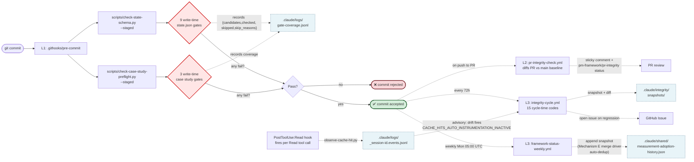

# Feature Lifecycle Event Catalog

> **Companion to** [`dev-guide-v1-to-v7-7.md`](./dev-guide-v1-to-v7-7.md). Where the dev-guide explains *how* the framework works (the four enforcement layers, schema, dispatch model), this catalog answers a different question: at any point in a feature's lifecycle, **what should be triggered, logged, measured, and persisted — and which gate enforces it?**
>
> **Authoritative for:** `FEATURE_CLOSURE_COMPLETENESS` gate spec — **PROMOTED TO ENFORCED 2026-05-21** in v7.9 (the gate was the single-line `BRANCH_ISOLATION_ADVISORY_MODE = True → False` flip target alongside `BRANCH_ISOLATION_VIOLATION` Mode B + Mode C). Previously advisory in v7.8.1 → v7.8.6 per [`framework-v7-8-branch-isolation` case study](../case-studies/framework-v7-8-branch-isolation-case-study.md). All 4 promotion criteria from [`docs/master-plan/infra-master-plan-2026-05-12.md`](../master-plan/infra-master-plan-2026-05-12.md) §2.2 met against 14d Mechanism A telemetry. **Phase E validation soak runs 2026-05-21 → 2026-06-04** — no new gate work this window per CLAUDE.md. **Note (v7.8.3, 2026-05-11):** the gate caught two real closure violations on the v7.8.3 ship itself (field name `case_study_link` vs canonical `case_study`; missing top-level `related_prs` array on closure PR #304). Both fixed pre-merge — see [cross-repo-state-sync-impl case study](../case-studies/cross-repo-state-sync-impl-case-study.md) for the dogfood story.
>
> **Phase 0.0 — Unified Preflight (v7.8.6, MANDATORY)**: Before Phase 0 (Research) or any work-type-specific Phase 1 (Tasks / Implement), `/pm-workflow` runs `make preflight WORK_TYPE=<feature|enhancement|fix|chore> [FEATURE=<name>]`. This writes `.claude/shared/preflight-cache.json` with W1 ssh-agent state + PR cache freshness + branch isolation + integrity findings + drift vs 2026-05-14 anchor + doc-debt + adoption baseline + work-type-specific check (feature state.json / enhancement parent / fix high-risk-touch / chore infra-path). All 10 skills read this cache from their `## Shared Data` section instead of re-collecting. Schema: [`docs/skills/preflight-cache-schema.md`](../skills/preflight-cache-schema.md). Block phase advancement if the preflight reports `summary.blocking > 0`.
>
> **Last verified against:** v7.10 (shipped 2026-06-10; GATE_COVERAGE_ZERO observability + field-rename closure — observability-only, no new product gates). v7.9.1 build window (2026-06-04) added F16/F17/F2 + dev-env CI but 0 new enforcement gates. **For canonical current gate counts always defer to [`../FRAMEWORK-FACTS.md`](../FRAMEWORK-FACTS.md)** (33 instrumented = 21 write-time + 9 cycle-time + 2 W9 hooks + 1 standalone; 34 live) — the per-phase "9 write-time / 15 cycle-time" figures below are an earlier-era count using a different denominator (gates firing on a typical commit vs all instrumented codes). State.json schema gained a top-level `state_owner` enum (`{"ft2", "fitme-story"}`) at v7.8.3 Phase 2 — 62 features backfilled in a single mechanical commit. New required field on all features going forward.

---

## 0. How to read this doc — 90-second tour

This catalog is a **reference**, not a tutorial. Every section is structured the same way: a 1-2 sentence purpose statement, then a table or list of named things. You don't read it cover-to-cover; you look up the thing you need.

**The 4 nested loops at a glance:**

| Loop | Cadence | Owns | Authority |
|---|---|---|---|
| **L0** Per-feature lifecycle | days to weeks | Research → PRD → Tasks → UX → Implement → Test → Review → Merge → Docs → Learn | the feature's `state.json` |
| **L1** Per-commit gates | seconds | 9 write-time gates via pre-commit hook | blocks the commit |
| **L2** Per-PR gates | minutes | `pr-integrity-check.yml` + `ci.yml` | blocks the merge |
| **L3** Periodic gates | hours to days | `integrity-cycle.yml` (72h) + `framework-status-weekly.yml` | opens an issue |

Authority increases as you go outer. L3 catches what L0/L1/L2 missed.

**Common operator questions → which § answers them:**

| Question | Section |
|---|---|
| What should be present on a `current_phase=complete` commit? | [§8 Phase-by-phase event matrix](#8-phase-by-phase-event-matrix) |
| What does `cu_v2` actually measure? | [§7 Measurement dimensions (Tier 1.1)](#7-measurement-dimensions-tier-11) |
| What files get written during a feature's lifecycle? | [§4 The artifact stack](#4-the-artifact-stack--every-file-written-during-a-features-lifecycle) |
| What hooks/crons fire when? | [§5 The trigger stack](#5-the-trigger-stack--every-hookcroncli-that-fires) |
| What gates block on what? | [§6 The gate stack](#6-the-gate-stack) |
| What's a Mechanism A/B/C/D/E/F? | [§0.5 Glossary](#05-glossary) + [§3 v7.8 mechanism inventory](#3-v78-mechanism-inventory) |
| What's the difference between Data-Quality tiers and Gate-class tiers? | [§2 Two orthogonal tier systems](#2-two-orthogonal-tier-systems) |
| What work-type uses how many phases? | [§1 The lifecycle hierarchy](#1-the-lifecycle-hierarchy) (4 work types × phase counts) |
| Where does THIS catalog fit in the doc ecosystem? | [companion `dev-guide-v1-to-v7-7.md`](./dev-guide-v1-to-v7-7.md) |

---

## 0.5 Glossary

Cross-cutting terms that appear in §§ 1–8 without inline definition. Look them up here first.

| Term | Definition |
|---|---|
| **L0 / L1 / L2 / L3 loops** | The four nested cadences. L0 = per-feature (days to weeks). L1 = per-commit (seconds). L2 = per-PR (minutes). L3 = periodic / 72h + weekly (hours to days). |
| **Mechanism A** | Coverage-asserting gates. Every write-time gate emits `{candidates, checked, skipped, skip_reasons}` per run to [`.claude/logs/gate-coverage.jsonl`](../../.claude/logs/gate-coverage.jsonl). Lets us detect silent-pass gates (`checked=0` for 7+ days). |
| **Mechanism B** | Schema field-rename detection + dual-read. `created` ∪ `created_at` migration window pattern; canonical `framework_version` field. |
| **Mechanism C** | `PostToolUse:Read` attribution. Auto-captures Read events with active-feature tag into [`.claude/logs/_session-<id>.events.jsonl`](../../.claude/logs/). |
| **Mechanism D** | Pre-commit hook header self-audit. Validates the hook header matches the implementation. |
| **Mechanism E** | Custom git merge driver. Auto-resolves merge conflicts on append-only ledgers (`measurement-adoption-history.json`, `documentation-debt.json`, `gate-coverage.jsonl`, per-feature `.log.json`) via union-dedup-by-key. |
| **Mechanism F** | Membrane status advisory. Single readout: active feature + recent gate firings + dispatch-blocker state via `make membrane-status`. |
| **Class A / B / C (gate classes)** | Gate enforcement category. **A** = mechanically enforced. **B** = mechanically unclosable (judgment / external operator / physical device required — see [`docs/case-studies/meta-analysis/unclosable-gaps.md`](../case-studies/meta-analysis/unclosable-gaps.md)). **C** = advisory en route to enforced after calibration window. Not the same as Data-Quality T1/T2/T3 tiers (§2). |
| **T1 / T2 / T3 (data-quality tiers)** | Every quantitative claim in a PRD, case study, or meta-analysis must carry one. **T1** = Instrumented (live metric from `.claude/shared/measurement-adoption.json` or `documentation-debt.json`). **T2** = Declared (PRD target / pre-registered threshold). **T3** = Narrative (estimate / approximation). Convention: [`docs/case-studies/data-quality-tiers.md`](../case-studies/data-quality-tiers.md). |
| **Tier 1.1 / 2.1 / 2.2 / 2.3 / 3.2 / 3.3 (audit tiers)** | Numbered remediation categories from the 2026-04-21 Gemini audit. 1.1 = measurement adoption ledger. 2.1 = runtime smoke gates. 2.2 = contemporaneous logging. 2.3 = data quality tiers. 3.2 = documentation-debt ledger. 3.3 = external replication. NOT the same as the T1/T2/T3 data-quality labels — these are remediation buckets. |
| **Phase / sub-phase** | A feature's `current_phase` is one of: research, prd, tasks, ux_or_integration, implement, test, review, merge, docs, complete. Each entered phase has a `status` block under `phases.<phase>` with `started_at`, `completed_at`, and one of `in_progress` / `complete` / `skipped` / `approved`. |
| **Work type** | One of: `feature` (10 phases), `enhancement` (4: tasks→implement→test→merge), `fix` (2: implement→test), `chore` (1: implement). Skipped phases recorded in audit trail. |
| **state.json** | Per-feature canonical contract at `.claude/features/<name>/state.json`. The single source of truth for that feature's lifecycle. |
| **state_owner enum** | Cross-repo schema field (v7.8.3+): `{"ft2", "fitme-story"}` — which repo owns the state.json file. Validated by `STATE_OWNER_LOCATION_MISMATCH` gate. |
| **Phase E** | A post-promotion validation soak (typically 14 days) where no new gates ship and the operator watches `gate-coverage.jsonl` for unexpected `failure` rows. v7.9 Phase E: 2026-05-21 → 2026-06-04. |
| **`make integrity-check`** | The cycle-time (72h cron) gate runner. Emits findings + advisories. Baseline goal: 0 findings + 0 advisory. |
| **`make preflight WORK_TYPE=<>`** | The Phase 0.0 unified entry point (v7.8.6). Aggregates W1 ssh-agent + PR cache + branch isolation + integrity + drift + doc-debt + adoption baseline + work-type check into `.claude/shared/preflight-cache.json`. |

---

## 1. The lifecycle hierarchy

The framework runs four nested loops. Each outer loop runs less often but is more authoritative.

```
┌─────────────────────────────────────────────────────────────────────────┐
│  L0 — Per-feature lifecycle (single feature, days to weeks)             │
│       Research → PRD → Tasks → UX → Implement → Test → Review →         │
│       Merge → Docs → Learn                                              │
│                                                                         │
│  ┌───────────────────────────────────────────────────────────────────┐  │
│  │  L1 — Per-commit gates (every git commit, ~seconds)               │  │
│  │       Pre-commit hook fires 9 write-time gates                    │  │
│  └───────────────────────────────────────────────────────────────────┘  │
│                                                                         │
│  ┌───────────────────────────────────────────────────────────────────┐  │
│  │  L2 — Per-PR gates (every push to a PR branch, ~minutes)          │  │
│  │       pr-integrity-check.yml + ci.yml workflows                   │  │
│  └───────────────────────────────────────────────────────────────────┘  │
│                                                                         │
│  ┌───────────────────────────────────────────────────────────────────┐  │
│  │  L3 — Periodic gates (cron-driven, hours to days)                 │  │
│  │       72h integrity-cycle.yml + weekly framework-status-weekly.yml│  │
│  └───────────────────────────────────────────────────────────────────┘  │
└─────────────────────────────────────────────────────────────────────────┘
```

**Per-phase counts by work type** (from CLAUDE.md):
- **Feature** — 10 phases (full lifecycle)
- **Enhancement** — 4 phases (Tasks → Implement → Test → Merge)
- **Fix** — 2 phases (Implement → Test)
- **Chore** — 1 phase (Implement)

Skipped phases are recorded in the audit trail with reason `work_type:{type}`.

---

## 1.5 End-to-end flow

Two complementary diagrams — the first shows the L0 lifecycle (phases + artifacts + key gates per transition); the second zooms into a single phase-transition commit to show how all four loops (L0–L3) interact at one moment in time.

### 1.5.1 The L0 phase lifecycle

```mermaid
flowchart TD
    Start([User runs /pm-workflow feature]) -->|"creates state.json<br/>+ .claude/logs/feature.log.json<br/>+ .claude/active-feature lockfile"| P1

    P1[Phase 1 — Research<br/>artifact: research.md]
    P1 -->|"phase_approved + transition log<br/>timing.phases.research.ended_at"| P2

    P2[Phase 2 — PRD<br/>artifact: docs/product/prd/feature.md<br/>required: cu_v2 + success_metrics + kill_criteria]
    P2 -->|"CU_V2_INVALID gate"| P3

    P3[Phase 3 — Tasks<br/>artifact: tasks.md]
    P3 -->|transition| P4

    P4["Phase 4 — UX/Integration<br/>artifact: ux-spec.md + figma-bridge-status.json<br/>auto-dispatched: /design build → figma_node_ids"]
    P4 -->|"/ux preflight + /design preflight<br/>(non-skippable skill-layer gates)"| P5

    P5[Phase 5 — Implementation<br/>artifact: code + tests + cache_hits accumulating]
    P5 -->|"make ui-audit P0=0"| P6

    P6["Phase 6 — Test + Pre-merge review<br/>required: pre_merge_review.{ux,design}<br/>BLOCK halts Phase 7 if either fails"]
    P6 -->|"verify-local green<br/>+ both pre-merge reviews PASS"| P7

    P7[Phase 7 — Review<br/>required: PR description references figma_node_ids]
    P7 -->|"pr-integrity-check.yml<br/>commit status: pm-framework/pr-integrity"| P8

    P8[Phase 8 — Merge<br/>required: phases.merge.pr_number]
    P8 -->|"PR_NUMBER_UNRESOLVED gate"| P9

    P9["Phase 9 — Documentation<br/>artifact: docs/case-studies/feature-case-study.md<br/>+ fitme-story showcase MDX"]
    P9 -->|"STATE_NO_CASE_STUDY_LINK<br/>+ CASE_STUDY_MISSING_FIELDS<br/>+ CASE_STUDY_MISSING_TIER_TAGS<br/>+ BROKEN_PR_CITATION<br/>+ CACHE_HITS_EMPTY_POST_V6"| P10

    P10[Phase 10 — Learn<br/>required: phases.learn.outcomes + closed_at<br/>post-launch metrics review at PRD-defined cadence]
    P10 -->|"current_phase=complete<br/>(no further write-time gates)"| Complete([Feature complete])

    classDef phase fill:#e8f4f8,stroke:#2c5d7c,stroke-width:2px
    classDef terminal fill:#d4edda,stroke:#155724,stroke-width:2px
    classDef start fill:#fff3cd,stroke:#856404,stroke-width:2px

    class P1,P2,P3,P4,P5,P6,P7,P8,P9,P10 phase
    class Complete terminal
    class Start start
```



### 1.5.2 What happens at one phase-transition commit (all four loops at once)



**How to read 1.5.2:**
- **Solid arrows** are synchronous flow during the commit itself (L1).
- **Dashed arrows** are downstream, asynchronous fan-outs that observe the same commit (L2 minutes later, L3 hours-to-days later).
- **Dotted-edged boxes** are append-only log files that accumulate across all commits.
- **Mechanism C** (`PostToolUse:Read`) is independent of `git commit` — it captures every Read tool call into the session ledger regardless of whether a commit happens.

The diagram makes the v7.8 design explicit: write-time gates (L1) cover *what was just changed*; cycle-time gates (L3) cover *what state.json claims about reality*; the per-PR bot (L2) covers *what this PR introduces vs main*. Each loop catches a different class of failure, and the same finding can appear at multiple loops as the gate gets promoted from advisory → enforced (Class C → B → A).

---

## 2. Two orthogonal tier systems

The framework uses two unrelated tier vocabularies that are easy to confuse.

### 2.1 Data-quality tiers (about claims, not gates)

Convention shipped 2026-04-21 per Gemini independent audit. Every quantitative claim in a PRD, case study, or meta-analysis carries one of:

| Tier | Meaning | How to verify |
|------|---------|---------------|
| **T1 — Instrumented** | Number is read directly from a logging/measurement artifact (state.json, GA4, gate-coverage.jsonl, etc.) | The artifact exists and contains the cited value |
| **T2 — Declared** | Number is stated by the author from memory, observation, or self-report | No mechanical verification possible; honesty is the contract |
| **T3 — Narrative** | Number is illustrative or directional (e.g. "saved ~2-4h") with no precise source | Treat as anecdote, not evidence |

Full convention: [`docs/case-studies/data-quality-tiers.md`](../case-studies/data-quality-tiers.md).

### 2.2 Gate enforcement classes (about gates, not claims)

Every gate sits at one of three enforcement strengths:

| Class | Trigger | Failure mode | Examples |
|-------|---------|--------------|----------|
| **Class A — Mechanical** | Pre-commit / CI workflow | Blocks the commit/merge | `SCHEMA_DRIFT`, `PHASE_TRANSITION_NO_LOG`, `STATE_NO_CASE_STUDY_LINK` |
| **Class B — Cycle-time** | 72h cron, weekly cron, per-PR bot | Posts comment / opens issue; doesn't block | `PHASE_LIE`, `TASK_LIE`, `NO_CS_LINK` |
| **Class C — Advisory** | Cycle-time but heuristic | Surfaces in dashboard; never blocks | `TIER_TAG_LIKELY_INCORRECT`, `CACHE_HITS_AUTO_INSTRUMENTATION_INACTIVE` |

The v7.5 → v7.6 → v7.7 → v7.8 progression has been a steady migration of gates from Class B → A as evidence accumulates that the gate is reliable enough to block writes.

---

## 3. v7.8 mechanism inventory

v7.8 (shipped 2026-05-04) added six cooperating mechanisms (A–F). All ship advisory in v7.8 and promote to enforced in v7.9 (window opens 2026-05-11):

| Mech | Name | What it does | Where the data lands |
|------|------|--------------|----------------------|
| **A** | Coverage-asserting gates | Every write-time gate emits `{candidates, checked, skipped, skip_reasons}` per run | [`.claude/logs/gate-coverage.jsonl`](../../.claude/logs/gate-coverage.jsonl) |
| **B** | Schema field-rename detection + dual-read | `created` ∪ `created_at` dual-read for migration window | [`scripts/migrate-state-v7-8-bridge.py`](../../scripts/migrate-state-v7-8-bridge.py) |
| **C** | PostToolUse:Read attribution | Auto-captures Read events with active-feature tag | [`.claude/logs/_session-<id>.events.jsonl`](../../.claude/logs/) |
| **D** | Pre-commit hook header self-audit | Validates the hook header matches the implementation | [`make pre-commit-self-test`](../../Makefile) |
| **E** | Custom git merge driver | Auto-resolves merge conflicts on append-only ledgers via union-dedup | [`scripts/merge-driver-dedup.py`](../../scripts/merge-driver-dedup.py) |
| **F** | Membrane status advisory | Single readout: active feature + recent gate firings + dispatch-blocker state | [`make membrane-status`](../../Makefile) |

---

## 4. The artifact stack — every file written during a feature's lifecycle

Sorted by lifecycle order. Each artifact has a *creator* (who writes it) and a *gate* (what enforces its presence/correctness).

| # | Artifact | Created by | Created when | Validated by |
|---|----------|------------|--------------|--------------|
| 1 | [`.claude/features/<feature>/state.json`](../../.claude/features/) | `/pm-workflow {feature}` | Phase 0 (init) | `make schema-check`, pre-commit `check-state-schema.py` |
| 2 | [`.claude/features/<feature>/research.md`](../../.claude/features/) | `/pm-workflow` Phase 1 | Research approval | (none — research artifacts are unstructured) |
| 3 | [`docs/product/prd/<feature>.md`](../../docs/product/prd/) | `/pm-workflow` Phase 2 | PRD approval | Manual review; `state.json::phases.prd.path` references it |
| 4 | [`.claude/features/<feature>/tasks.md`](../../.claude/features/) | `/pm-workflow` Phase 3 | Tasks approval | (none — task list is narrative) |
| 5 | [`.claude/features/<feature>/ux-spec.md`](../../.claude/features/) | `/ux spec {feature}` | Phase 4 (UX) | `/ux preflight` (token/component existence check) |
| 6 | [`.claude/features/<feature>/figma-bridge-status.json`](../../.claude/features/) | `/design preflight` | Phase 4 (UX) | `/design preflight` (Figma MCP liveness) |
| 7 | [`docs/prompts/ui/<date>-<feature>-design-build.md`](../../docs/prompts/ui/) | `/design build` (fallback when Figma MCP down) | Phase 4 (UX) | (fallback only — primary path writes to Figma) |
| 8 | [`.claude/logs/<feature>.log.json`](../../.claude/logs/) | `scripts/append-feature-log.py` on every phase transition | Each phase change | Pre-commit `PHASE_TRANSITION_NO_LOG` |
| 9 | [`.claude/logs/_session-<id>.events.jsonl`](../../.claude/logs/) | `scripts/observe-cache-hit.py` (PostToolUse:Read hook) | Every Read tool call | (advisory — drift fires `CACHE_HITS_AUTO_INSTRUMENTATION_INACTIVE`) |
| 10 | [`.claude/logs/gate-coverage.jsonl`](../../.claude/logs/) | Every pre-commit gate run | Each gate invocation | (advisory — `GATE_COVERAGE_ZERO` v7.9-enforced) |
| 11 | [`.claude/active-feature`](../../.claude/) | `/pm-workflow` on entry | Session start | (lockfile; Mechanism C reads it) |
| 12 | [`docs/case-studies/<feature>-case-study.md`](../../docs/case-studies/) | Phase 9 (Docs) | Phase 9 approval | Pre-commit `CASE_STUDY_MISSING_FIELDS` + `CASE_STUDY_MISSING_TIER_TAGS` + `STATE_NO_CASE_STUDY_LINK` |
| 13 | `fitme-story/content/04-case-studies/<NN>-<slug>.mdx` | Phase 9 (Docs) | Phase 9 approval | Manual review; `state.json::case_study_showcase` references it |
| 14 | [`.claude/integrity/snapshots/<timestamp>.json`](../../.claude/integrity/snapshots/) | 72h `integrity-cycle.yml` cron | Every 72h | (the snapshot IS the audit) |
| 15 | [`.claude/shared/measurement-adoption-history.json`](../../.claude/shared/measurement-adoption-history.json) | Weekly `framework-status-weekly.yml` cron | Mondays 05:00 UTC | (append-only ledger; Mechanism E merge driver) |
| 16 | [`.claude/shared/documentation-debt.json`](../../.claude/shared/documentation-debt.json) | `make documentation-debt` (on-demand or weekly cron) | On-demand + weekly | (point-in-time; trend mode requires 3+ snapshots) |

---

## 5. The trigger stack — every hook/cron/CLI that fires

Sorted by frequency (most frequent first).

### 5.1 Per-tool-call (sub-second)

| Trigger | Source | Action |
|---------|--------|--------|
| `PostToolUse:Read` | [`.claude/settings.json`](../../.claude/settings.json) hook | Runs `scripts/observe-cache-hit.py` → appends to `_session-<id>.events.jsonl` (Mechanism C) |
| `PostToolUse:Bash` (added v7.8.5 2026-05-13) | [`.claude/settings.json`](../../.claude/settings.json) hook | Runs `scripts/check-branch-drift.py` (W9 pattern detector) → records current branch on first call, compares + emits LOUD stderr warning on drift, updates baseline. Real-time alert surfaced back to assistant via tool output. Per-session state at `.claude/_session-state/<session_id>-branch.txt` (gitignored). Disable: `CLAUDE_W9_DISABLE_DRIFT_CHECK=1`. |

### 5.2 Per-commit (~seconds)

| Trigger | Source | Action |
|---------|--------|--------|
| `git commit` | [`.githooks/pre-commit`](../../.githooks/pre-commit) | Runs `check-state-schema.py --staged` + `check-case-study-preflight.py --staged`. Fires 9 write-time gates (see §6). Bypassed only via `--no-verify`. |

### 5.3 Per-session-start (once per Claude Code session)

| Trigger | Source | Action |
|---------|--------|--------|
| `SessionStart` | [`.claude/settings.json`](../../.claude/settings.json) hook | Lists active features (`current_phase` per feature) + surfaces `.claude/active-feature` if set |

### 5.4 Per-PR (every push to a PR branch, ~minutes)

| Trigger | Workflow | Action |
|---------|----------|--------|
| `pull_request` | [`.github/workflows/ci.yml`](../../.github/workflows/ci.yml) | `make verify-local` (tokens-check + schema-check + ui-audit + ui-audit-drift + verify-web/ai/evals/ios/timing/framework) + `xcodebuild build` + `xcodebuild test` |
| `pull_request` | [`.github/workflows/pr-integrity-check.yml`](../../.github/workflows/pr-integrity-check.yml) | Diffs PR HEAD vs `origin/main` baseline; fails if PR introduces NEW integrity findings; sticky comment with marker `pm-framework-pr-integrity-bot`; sets `pm-framework/pr-integrity` commit status |

### 5.5 Periodic (cron-driven)

| Cadence | Workflow | Action |
|---------|----------|--------|
| Every 72h | [`.github/workflows/integrity-cycle.yml`](../../.github/workflows/integrity-cycle.yml) | Runs `integrity-check.py`; writes snapshot to `.claude/integrity/snapshots/`; commits to main; opens issue on regression |
| Mondays 05:00 UTC | [`.github/workflows/framework-status-weekly.yml`](../../.github/workflows/framework-status-weekly.yml) | Runs `make framework-status`; appends to `measurement-adoption-history.json` (dedup by date); opens `framework-status` issue on regression |

### 5.6 On-demand readouts (CLI, no automation)

| Command | Source | Output |
|---------|--------|--------|
| `make integrity-check` | `scripts/integrity-check.py --findings-only` | 15 cycle-time check codes printed to stdout |
| `make integrity-snapshot` | `scripts/integrity-check.py --snapshot ...` | Writes new snapshot + diffs vs previous |
| `make schema-check` | `scripts/check-state-schema.py` | Validates all 53+ state.json against canonical schema |
| `make documentation-debt` | `scripts/documentation-debt-report.py` | Open debt items + per-field coverage |
| `make measurement-adoption` | `scripts/measurement-adoption-report.py` | Tier 1.1 fully/partial/zero counts; appends to history |
| `make framework-status` | `scripts/framework-status.sh` | Combined readout used by weekly cron |
| `make membrane-status` | `scripts/membrane-status.py` | Active feature + recent gate firings + dispatch-blocker state (Mechanism F) |
| `make runtime-smoke PROFILE=<id>` | `scripts/runtime-smoke-gate.py` | Tier 2.1 smoke-gate runner; 5 profiles incl. `sign_in_surface` |
| `make validate-tier-tags` | `scripts/validate-tier-tags.py` | T1/T2/T3 presence + likely-correctness audit |
| `make pre-commit-self-test` | `scripts/pre-commit-self-test.py` | Mechanism D — validates hook header matches implementation |
| `make ui-audit` | `scripts/ui-audit.py` | Per-view design-system compliance scanner; P0 gating |
| `make tokens-check` | `scripts/check-tokens.js` | Design token drift detector |

---

## 6. The gate stack

### 6.1 Write-time gates (Class A, fire on `git commit`)

All implemented in [`scripts/check-state-schema.py`](../../scripts/check-state-schema.py) or [`scripts/check-case-study-preflight.py`](../../scripts/check-case-study-preflight.py). Self-audit: `make pre-commit-self-test` (Mechanism D).

| # | Code | Shipped | What it checks |
|---|------|---------|----------------|
| 1 | `SCHEMA_DRIFT` | v7.5 (2026-04-21) | Rejects legacy `phase` key on state.json (canonical: `current_phase`) |
| 2 | `SCHEMA_DRIFT_LEGACY_CREATED` | 2026-05-01 (PR #169) | Rejects legacy `created` key (canonical: `created_at`) |
| 3 | `PR_NUMBER_UNRESOLVED` | v7.5 (2026-04-21) | Verifies `phases.merge.pr_number` resolves via `gh pr view`; skipped if `gh` unavailable |
| 4 | `PHASE_TRANSITION_NO_LOG` | v7.6 (2026-04-25) | Rejects `current_phase` change without a fresh log event in `<feature>.log.json` (≤15min old) |
| 5 | `PHASE_TRANSITION_NO_TIMING` | v7.6 (2026-04-25) | Rejects `current_phase` change without `timing.phases.<old>.ended_at` + `timing.phases.<new>.started_at` |
| 6 | `BROKEN_PR_CITATION` | v7.6 (2026-04-25) | Case study cites a PR via `PR #N` or `pull/N` that doesn't resolve |
| 7 | `CASE_STUDY_MISSING_TIER_TAGS` | v7.6 (2026-04-25) | Post-2026-04-21 case studies must contain at least one `T1`/`T2`/`T3` tag |
| 8 | `CACHE_HITS_EMPTY_POST_V6` | v7.7 (2026-04-27) | Post-v6 feature reaching `current_phase=complete` with empty `cache_hits[]` |
| 9 | `CU_V2_INVALID` | v7.7 (2026-04-27) | `cu_v2` schema check: 4 required factors in [0,1], `total` matches sum, `tier_class` ∈ {A_high, B_medium, C_low} |
| 10 | `STATE_NO_CASE_STUDY_LINK` | v7.7 (2026-04-27) | `current_phase=complete` requires `case_study` / `parent_case_study` link OR exempt `case_study_type` |
| 11 | `CASE_STUDY_MISSING_FIELDS` | v7.7 (2026-04-27) | Case study frontmatter required-fields check (work_type, framework_version, etc.) |
| 12 | `FRAMEWORK_VERSION_FORMAT` | 2026-05-01 (PR #169) | When set, must match `(pre-)?v<major>.<minor>` |
| 13 | `ISOLATION_OPT_OUT_REASON_MISSING` | **v7.8.1** (2026-05-07, PR #244) | When `state.json::isolation_opt_out: true`, `isolation_opt_out_reason` must be non-empty |
| 14 | `BRANCH_ISOLATION_VIOLATION` | **v7.8.1** (2026-05-07, PR #244, **advisory** → enforced in v7.9) | Mode B fires on every commit when staged files match infra-path globs (`.githooks/*`, `.github/workflows/*`, `scripts/*`, `.claude/skills/*`, `.claude/shared/*`, `CLAUDE.md`, `docs/architecture/*`, `Makefile`); Mode C fires on `current_phase` mutations from non-feature branch. Auto-isolation flow dispatches `scripts/create-isolated-worktree.py`. Per-feature `isolation_opt_out: true` bypasses Mode C only |
| 15 | `FEATURE_CLOSURE_COMPLETENESS` | **v7.8.1** (2026-05-07, PR #244, **advisory** → enforced in v7.9) | Fires on `current_phase=complete` transitions. Validates 7 required case-study frontmatter fields + Q7 (`kill_criteria_resolution` required when `kill_criteria` set) + Q6 bidirectional PR-list parity (state.json ↔ case study, override via `pr_citation_exempt`) |

### 6.2 Cycle-time check codes (Class B, fire every 72h)

Implemented in [`scripts/integrity-check.py`](../../scripts/integrity-check.py).

| Code | What it checks |
|------|----------------|
| `PHASE_LIE` | Top-level terminal phase but sub-phases still pending/in-progress |
| `TASK_LIE` | Top-level terminal but tasks still pending/in-progress/open/blocked |
| `NO_CS_LINK` | Terminal phase but no `case_study` link or exempt tag |
| `V2_FILE_MISSING` | State declares `v2_file_path` that doesn't exist on disk |
| `PARTIAL_SHIP_TERMINAL` | `partial_ship: true` alongside terminal phase |
| `NO_STATE` | Feature directory has no state.json |
| `INVALID_JSON` | state.json is malformed |
| `NO_PHASE` | Missing `current_phase` field |
| `SCHEMA_DRIFT` | Cycle-time mirror of write-time gate (catches `--no-verify` bypass) |
| `PR_NUMBER_UNRESOLVED` | Cycle-time mirror of write-time gate |
| `BROKEN_PR_CITATION` | Cycle-time mirror of write-time gate |
| `CASE_STUDY_MISSING_TIER_TAGS` | Cycle-time mirror of write-time gate |
| `CU_V2_INVALID` | Cycle-time mirror of write-time gate |
| `CACHE_HITS_AUTO_INSTRUMENTATION_INACTIVE` | Mechanism C advisory — session ledger has Reads but state.json::cache_hits[] is empty |
| `TIER_TAG_LIKELY_INCORRECT` | Heuristic — T1 claim with no ledger match (advisory permanent per kill criterion 2) |

### 6.3 Advisory (Class C, never blocks)

| Code | What it surfaces |
|------|------------------|
| `GATE_COVERAGE_ZERO` | (v7.9-enforced) write-time gate that fired with `checked=0` for 7+ days |
| `CACHE_HITS_AUTO_INSTRUMENTATION_INACTIVE` | Mechanism C: drift between session events and state.json::cache_hits[] |
| `TIER_TAG_LIKELY_INCORRECT` | Numeric T1 claim that doesn't match any known ledger value |

---

## 7. Measurement dimensions (Tier 1.1)

Four dimensions tracked per feature in state.json. Coverage is reported by `make measurement-adoption`.

| Dimension | Field | Populated by | Coverage as of 2026-05-07 |
|-----------|-------|--------------|---------------------------|
| **timing.phases (per-phase wall time)** | `timing.phases.<phase>.started_at` + `ended_at` | Pre-commit `PHASE_TRANSITION_NO_TIMING` gate (v7.6+) | 15/53 overall (28.3%); 12/19 post-v6 (63.2%) |
| **timing_wall_time (total feature wall time)** | derived from `timing.phases` extremes | Same as above | 7/53 overall (13.2%); 7/19 post-v6 (36.8%) |
| **cache_hits[]** | `cache_hits` array | Manual `scripts/log-cache-hit.py` (auto-instrumentation in v7.9 via Mechanism C promotion) | 6/53 overall (11.3%); 6/19 post-v6 (31.6%) |
| **cu_v2 (continuous complexity factors)** | `cu_v2.factors.{complexity,blast_radius,novelty,verification_difficulty}` ∈ [0,1] + `total` + `tier_class` | Manual at PRD time | 7/53 overall (13.2%); 7/19 post-v6 (36.8%) |

A feature is **fully adopted** only when all 4 dimensions are present. As of 2026-05-07: 3/19 post-v6 features fully adopted.

---

## 8. Phase-by-phase event matrix

For a Feature work-type. For each phase: what triggers, what gets logged, what gates fire, what artifacts get written.

### Phase 1 — Research

| What | Detail |
|------|--------|
| **Triggers** | User runs `/pm-workflow {feature}` |
| **Logs** | `state.json` created with `current_phase=research`; `<feature>.log.json` opened with `phase_started: research` event |
| **Gates** (write-time on phase-init commit) | `SCHEMA_DRIFT`, `SCHEMA_DRIFT_LEGACY_CREATED`, `PHASE_TRANSITION_NO_LOG`, `PHASE_TRANSITION_NO_TIMING`, `FRAMEWORK_VERSION_FORMAT` |
| **Required state.json fields** | `feature_name` / `feature`, `current_phase`, `created_at`, `framework_version`, `work_type` |
| **Required artifacts** | `research.md` |
| **Phase exit gate** | User-approved transition to `prd` |

### Phase 2 — PRD

| What | Detail |
|------|--------|
| **Triggers** | User approves research → PRD authoring begins |
| **Logs** | `<feature>.log.json` appends `phase_approved: research` + `phase_started: prd`; `state.json::timing.phases.research.ended_at` + `prd.started_at` |
| **Gates** | `PHASE_TRANSITION_NO_LOG`, `PHASE_TRANSITION_NO_TIMING`, `CU_V2_INVALID` (cu_v2 typically authored at PRD time) |
| **Required artifacts** | `docs/product/prd/<feature>.md` with: success_metrics + kill_criteria tables, primary_metric named, post-launch review cadence |
| **Required state.json fields** | `phases.prd.path`, `cu_v2.{factors,total,tier_class}` |
| **Phase exit gate** | User-approved transition to `tasks` |

### Phase 3 — Tasks

| What | Detail |
|------|--------|
| **Triggers** | PRD approved |
| **Logs** | `<feature>.log.json` appends transition event + timing |
| **Gates** | `PHASE_TRANSITION_NO_LOG`, `PHASE_TRANSITION_NO_TIMING` |
| **Required artifacts** | `tasks.md` with E-core / P-core split |
| **Required state.json fields** | `tasks[]` array with task IDs |
| **Phase exit gate** | User-approved transition to `ux_or_integration` |

### Phase 4 — UX / Integration

| What | Detail |
|------|--------|
| **Triggers** | Tasks approved; `/ux spec {feature}` invoked |
| **Logs** | Transition event + timing; `figma-bridge-status.json` written by `/design preflight` |
| **Gates** (skill-layer) | `/ux preflight` (token/component existence in code), `/design preflight` (Figma MCP liveness) — both **non-skippable** |
| **Sub-step 4.j (auto-dispatched)** | `/design build` pushes screens into FitMe DS Library; falls back to `docs/prompts/ui/<date>-<feature>-design-build.md` if Figma MCP unreachable |
| **Required artifacts** | `ux-spec.md`, `figma-bridge-status.json` |
| **Required state.json fields** | `figma_node_ids` (populated by `/design build`) |
| **Phase exit gate** | User-approved transition to `implementation` |

### Phase 5 — Implementation

| What | Detail |
|------|--------|
| **Triggers** | UX spec approved |
| **Logs** | Transition + timing; `cache_hits[]` should accumulate via `scripts/log-cache-hit.py` (manual until v7.9); session events auto-captured by Mechanism C |
| **Gates** | `PHASE_TRANSITION_NO_LOG`, `PHASE_TRANSITION_NO_TIMING`, `make ui-audit` (P0=0 hard gate within `verify-local`) |
| **Required state.json fields** | `phases.implementation.commits[]`, `cache_hits[]` (post-v6) |
| **Phase exit gate** | User-approved transition to `test` |

### Phase 6 — Test + Pre-merge review

| What | Detail |
|------|--------|
| **Triggers** | Implementation done |
| **Logs** | Transition + timing |
| **Gates** | `xcodebuild test` (XCTest suite), `make verify-local` |
| **Skill-layer gates (v4.X, mandatory)** | `/ux pre-merge-review` (sets `state.json::pre_merge_review.ux`); `/design pre-merge-review` (sets `state.json::pre_merge_review.design`; checks `make ui-audit` P0=0 + `figma_node_ids` populated + PR description references those node IDs). BLOCK halts Phase 7. |
| **Phase exit gate** | Both pre-merge reviews PASS + CI green |

### Phase 7 — Review

| What | Detail |
|------|--------|
| **Triggers** | Tests pass, pre-merge reviews pass |
| **Per-PR L2 gates** | `pr-integrity-check.yml` posts sticky comment with marker `pm-framework-pr-integrity-bot`, sets `pm-framework/pr-integrity` commit status |
| **Required PR description** | Must reference `state.json::figma_node_ids` for any UI-touching PR |
| **Phase exit gate** | User-approved transition to `merge` |

### Phase 8 — Merge

| What | Detail |
|------|--------|
| **Triggers** | Review approved + CI green on both branches (feature + main) |
| **Logs** | `phases.merge.pr_number` set; `state.json::pre_merge_review.{ux,design}` mirrored |
| **Gates** | `PR_NUMBER_UNRESOLVED` (verifies the PR resolves via `gh pr view`) |
| **Required state.json fields** | `phases.merge.pr_number`, `phases.merge.merge_commit` |
| **Phase exit gate** | User-approved transition to `documentation` |

### Phase 9 — Documentation

| What | Detail |
|------|--------|
| **Triggers** | Merge complete |
| **Logs** | Transition + timing |
| **Gates (write-time, on commit that flips to `complete`)** | `STATE_NO_CASE_STUDY_LINK`, `CASE_STUDY_MISSING_FIELDS`, `CASE_STUDY_MISSING_TIER_TAGS`, `BROKEN_PR_CITATION`, `CACHE_HITS_EMPTY_POST_V6` |
| **Required artifacts** | (a) `docs/case-studies/<feature>-case-study.md` (source) AND (b) `fitme-story/content/04-case-studies/<NN>-<slug>.mdx` (showcase MDX) per the 2026-04-30 publication rule |
| **Required case study frontmatter** | `title`, `framework_version`, `work_type`, `date_written` (or `date`), `dispatch_pattern`, `success_metrics` (or `primary_metric`), `kill_criteria`, `tier_tags_present: true` |
| **Required state.json fields** | `case_study` link to (a); `case_study_showcase` link to (b) |
| **Cycle-time mirror** | `NO_CS_LINK`, `CASE_STUDY_MISSING_TIER_TAGS`, `BROKEN_PR_CITATION`, `STATE_NO_CASE_STUDY_LINK` all run on the next 72h cycle |
| **Phase exit gate** | User-approved transition to `learn` (or directly to `complete`) |

### Phase 10 — Learn

| What | Detail |
|------|--------|
| **Triggers** | Case study committed |
| **Required state.json fields** | `phases.learn.outcomes[]`, `phases.learn.closed_at` |
| **Post-launch metrics review** | At cadence defined in PRD (typically T+7d for first review, then monthly) |
| **Phase exit gate** | `current_phase=complete` (or `closed`) |

---

## 9. Worked example — `import-training-plan` traced through every phase

A real feature, shipped 2026-05-06 via PR #234. Use this as a reference for "what should be present at each step." Trace data: [`.claude/features/import-training-plan/`](../../.claude/features/import-training-plan/), [`docs/case-studies/import-training-plan-case-study.md`](../case-studies/import-training-plan-case-study.md).

| Phase | Date | Artifact written | Log event | Gate that fired |
|-------|------|------------------|-----------|-----------------|
| Research | 2026-04-15 | `state.json` (initial), `research.md` | `phase_started: research` | `SCHEMA_DRIFT` (passed) |
| PRD | 2026-04-15 | `docs/product/prd/import-training-plan.md` (v1) | `phase_started: prd` | `CU_V2_INVALID` (passed; cu_v2 added) |
| Tasks | 2026-04-15 | `tasks.md` | transition events | `PHASE_TRANSITION_NO_LOG/TIMING` (passed) |
| UX (resume) | 2026-05-06 | `ux-spec.md` v2, `figma-bridge-status.json` | resume transition | **`/ux preflight` caught 4 P0 spec errors** (`AppRadius.pill`, `AppMotion.standardEase`, `SettingsActionLabel` custom badge, `.contextMenu`/`.swipeActions` patterns not in code) — saved 2-4h of Phase 5 rework |
| UX 4.j | 2026-05-06 | Figma page 916:2 + 4 frames in DS Library `0Ai7s3fCFqR5JXDW8JvgmD` | — | `/design build` first production run; `figma_node_ids` populated |
| Implementation | 2026-05-06 | iOS code (persistence + active-plan + GDPR + 9 events) | transition events | `make ui-audit` P0=0 |
| Test | 2026-05-06 | 33 new XCTests | — | `xcodebuild test` pass; `make verify-local` green |
| Pre-merge review | 2026-05-06 | `state.json::pre_merge_review.{ux,design}` set | — | Both PASS |
| Merge | 2026-05-06 | PR #234 merged (squash); `phases.merge.pr_number=234` | — | `PR_NUMBER_UNRESOLVED` (passed) |
| Documentation | 2026-05-06 | `docs/case-studies/import-training-plan-case-study.md` + `fitme-story/content/04-case-studies/23b-import-training-plan.mdx` | `phase_started: documentation` | `STATE_NO_CASE_STUDY_LINK`, `CASE_STUDY_MISSING_FIELDS`, `CASE_STUDY_MISSING_TIER_TAGS`, `BROKEN_PR_CITATION` (all passed) |
| Learn → Complete | 2026-05-06 | `current_phase=complete` | `phase_completed` | All gates passed |
| **Post-ship advisory** | 2026-05-07 | — | — | `CACHE_HITS_AUTO_INSTRUMENTATION_INACTIVE` advisory: 95 Read events captured by Mechanism C but `state.json::cache_hits[]` empty (writer-path adoption gap, expected pre-v7.9) |
| **Post-ship readout** | 2026-05-07 | — | — | `make documentation-debt` flagged missing `dispatch_pattern` + `success_metrics` in frontmatter (later reconciled — see 2026-05-07 reconcile session) |

The post-ship advisory + readout findings are exactly what `FEATURE_CLOSURE_COMPLETENESS` will catch at write-time once promoted from advisory to gate.

---

## 10. Cross-reference table — one-page summary

| Phase | Required state.json fields | Required artifacts | Write-time gates that fire on phase-exit commit |
|-------|---------------------------|--------------------|------------------------------------------------|
| Research | `feature_name`, `current_phase`, `created_at`, `framework_version`, `work_type` | `state.json`, `research.md` | `SCHEMA_DRIFT*`, `PHASE_TRANSITION_NO_LOG/TIMING`, `FRAMEWORK_VERSION_FORMAT` |
| PRD | `cu_v2.{factors,total,tier_class}`, `phases.prd.path` | `docs/product/prd/<feature>.md` | `CU_V2_INVALID` |
| Tasks | `tasks[]` | `tasks.md` | `PHASE_TRANSITION_NO_LOG/TIMING` |
| UX | `figma_node_ids`, `phases.ux_or_integration.compliance_passed` | `ux-spec.md`, `figma-bridge-status.json` | `/ux preflight`, `/design preflight` (skill-layer, non-skippable) |
| Implement | `phases.implementation.commits[]`, `cache_hits[]` (post-v6) | code + tests | `make ui-audit` P0=0 |
| Test | `phases.test.unit_tests_passing` | passing tests | `xcodebuild test`, `make verify-local` |
| Pre-merge | `pre_merge_review.{ux,design}` | — | `/ux pre-merge-review`, `/design pre-merge-review` |
| Review | — | PR description references `figma_node_ids` | `pr-integrity-check.yml` |
| Merge | `phases.merge.pr_number`, `phases.merge.merge_commit` | merged PR | `PR_NUMBER_UNRESOLVED` |
| Docs | `case_study`, `case_study_showcase` | source `.md` + showcase `.mdx` | `STATE_NO_CASE_STUDY_LINK`, `CASE_STUDY_MISSING_FIELDS`, `CASE_STUDY_MISSING_TIER_TAGS`, `BROKEN_PR_CITATION`, `CACHE_HITS_EMPTY_POST_V6` |
| Learn | `phases.learn.outcomes[]`, `phases.learn.closed_at` | post-launch metrics review | (none — terminal) |

---

## 11. What this catalog does NOT cover

Honesty section. Five known mechanical limits per CLAUDE.md `Known Mechanical Limits`:

1. **`cache_hits[]` writer-path adoption** — auto-collected in v7.8 advisory via Mechanism C; v7.9 promotes to enforced.
2. **`cu_v2` factor *correctness*** — judgment-based; we check presence, not magnitude.
3. **T1/T2/T3 tag *correctness*** — preflight checks presence, not whether the tag is right.
4. **Tier 2.1 real-provider auth checklist** — requires a human at a simulator.
5. **Tier 3.3 external replication** — requires an external operator.

Authoritative reference: [`docs/case-studies/meta-analysis/unclosable-gaps.md`](../case-studies/meta-analysis/unclosable-gaps.md).

The `FEATURE_CLOSURE_COMPLETENESS` gate (planned in [`framework-v7-8-branch-isolation`](../../.claude/features/framework-v7-8-branch-isolation/state.json)) closes a sixth gap that this catalog surfaces: **state.json ↔ case-study cross-reference completeness**. Today, missing frontmatter fields are detectable only post-hoc via `make documentation-debt`. The closure-completeness gate promotes that to write-time on the `current_phase → complete` commit.

---

## 12. Related canonical references

| Topic | Source |
|-------|--------|
| Framework dev-guide (how it works) | [`docs/architecture/dev-guide-v1-to-v7-7.md`](./dev-guide-v1-to-v7-7.md) |
| Integrity cycle README | [`.claude/integrity/README.md`](../../.claude/integrity/README.md) |
| Project rules + framework summary | [`CLAUDE.md`](../../CLAUDE.md) |
| Data-quality tier convention | [`docs/case-studies/data-quality-tiers.md`](../case-studies/data-quality-tiers.md) |
| Unclosable gaps | [`docs/case-studies/meta-analysis/unclosable-gaps.md`](../case-studies/meta-analysis/unclosable-gaps.md) |
| v7.5 case study (8 cooperating defenses) | [`docs/case-studies/data-integrity-framework-v7.5-case-study.md`](../case-studies/data-integrity-framework-v7.5-case-study.md) |
| v7.6 case study (mechanical enforcement) | [`docs/case-studies/mechanical-enforcement-v7-6-case-study.md`](../case-studies/mechanical-enforcement-v7-6-case-study.md) |
| v7.7 case study (validity closure) | [`docs/case-studies/framework-v7-7-validity-closure-case-study.md`](../case-studies/framework-v7-7-validity-closure-case-study.md) |
| v7.8 case study (bridge to v7.9) | [`docs/case-studies/framework-v7-8-bridge-case-study.md`](../case-studies/framework-v7-8-bridge-case-study.md) |
| v7.8 + v7.9 bridge spec | [`docs/superpowers/specs/2026-05-02-framework-v7-8-and-v7-9-bridge-design.md`](../superpowers/specs/2026-05-02-framework-v7-8-and-v7-9-bridge-design.md) |

---

**Maintenance contract:** when a new gate ships, add a row to §6. When a new artifact is introduced, add a row to §4. When a new mechanism lands, add a row to §3. When the lifecycle phase model changes, update §1 and §8. The doc rots fast if it isn't kept current — a stale catalog is worse than no catalog.
